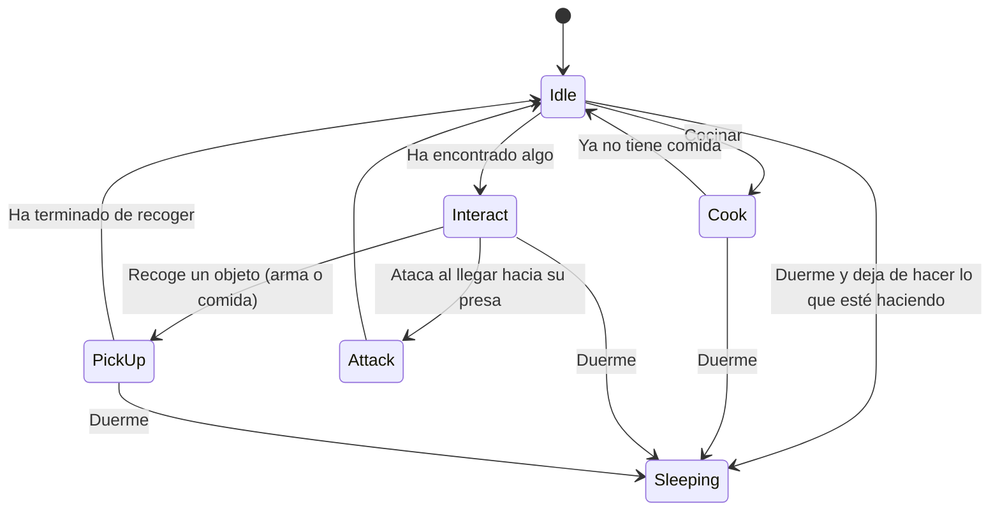

# IA-ProyectoFinal
## Autores
- Sara Isabel Garcia Moral (sarais02). Encargada de hacer lo comportamientos de los enemigos (ver más abajo).
- Javier Comas de Frutos (javixxu). Encargado de la herramienta de creacion de mundos procedurales y objectos colocados proceduralmente a lo largo del mapa

## Propuesta

### Herramienta de Creacion de Mundos Procedurales
La creacion de un mundo procedural completamente parametrizada con sistema de capas de terreno y creacion de objectos a lo largo de este.Ademas dicho terreno
generado ha de estar optimizado para que se pueda llegar a generar una gram superfice de terreno.

Como la creacion de un mundo completamente "aleatorio" puede resultar algo compleja se ha decidido establecer los siguientes parametros para que el usuario
pueda modificar a su antojo para crear el mundo con el terreno y objectos que desee):
  - int mapSize: Tamaño del Mapa
  - float NoiseScale: El factor de escala del ruido generado. Un valor mayor producirá un ruido con detalles más finos
  - int Octaves:  El número de octavas utilizadas en el algoritmo de ruido.Cada octava es una capa de ruido que se suma al resultado final.
    A medida que se agregan más octavas, el ruido generado se vuelve más detallado
  - float Persistance: Controla la amplitud de cada octava.Un valor más bajo reducirá el efecto de las octavas posteriores de las octavas posteriores
  - float Lacunarity: Un multiplicador que determina qué tan rápido aumenta la frecuencia para cada octava sucesiva en una función de ruido de Perlin
  - int Seed: Numero aleatorio utilizado para generar el ruido
  - Vector2 Offset: La posición inicial del ruido generado
  - TerrainType[]regions: Layers del terreno que se pueden generar
  - ObjectInMap[]objects: Objectos que se pueden generar a lo largo del mapa
  - bool useFallOff: Generar un suavizado en el ruido generado de tal forma que el mapa tenga forma de isla
  - bool autoUpdate: Cuando se realize un cambio des de el editor, auto actualizar el mapa
  - bool autoRegenerate: Cuando se inicilize este componente autoregenerar el terreno

Establecidos todos estos parametros tendremos varias posibilidades, tipos de configuracion para la generacion. Es posible que nosotros queramos previsualizar el mapa que estemos generando en 2D antes que 3D para ello,
tendremos varios modos de creacion:
  - NoiseMap: Generacion de un Mapa de Con los layers de terreno establecidos(Solo visual 2D)
  - ColorMap: Generacion de un Mapa de Ruido con  los bordes del terreno suavizados(Solo visual 2D)
  - FallOff: Generacion de un Mapa de Con los layers de terreno establecidos(Solo visual 3D)
  - NoObjects: Generacion de un Mapa de Con los layers de terreno establecidos y los Objectos puestos para generar(Solo visual 3D)
  - Objects: Generacion de un Mapa de Con los layers de terreno establecidos y los Objectos puestos para generar(Solo visual 3D)
  - NobjectsWithDisplay: Configuracion de ColorMap y NoObjects     
  - All: Configuracion de ColorMap y Objects
En el inspector de unity, existe un boton para generar el mapa.

### IA de comportamientos de personajes
Este proyecto consiste en la recreacion del comportamiento lo más realista y organico posible de unos seres hostiles que habitan en un bosque. Teniendo en cuenta todo lo que encuentran a su alrededor realizaran unas acciones u otras. Si encuentran algun animal cerca lo perseguirán y cuando este cerca lo atará (accion de cazar), obteniendo al matarlo un numero aleatorio de trozos de carne. Si ve alimentos (frutas y verduras) en las inmediaciones, se acercará a ellas y las cogerá, acumulando comida. Si tiene comida y encuentra un fuego cerca cocinara, gastando la comida acumulada que tiene. Si ve algun arma clavada en el suelo, y esa arma es más poderosa que la que lleva en ese momento o si no tiene arma, la recoerá y cambiará por lo que lleva en ese momento. Si ve al jugador, le perseguirá y atacará. En este proyecto para dar más realismo habrá un ciclo de día y noche, por lo que cuando sea de noche los personajes dejarán lo que esten haciendo y se dormirán.
 
### Combinacion de ambas propuestas
Sera un nivel en el que los personajes se instanciaran proceduralmente por el mapa y realizara sus distintos comportamientos. Pudiendo el jugador observarles desde la lejania ya que si te ven iran a por el.

## Diseño de la solución

### Herramienta de Creacion de Mundos Procedurales
La Herramienta posee varios "elementos basicos" que facilitan la creacion del mundo:

  - Class Chunk: Un chunk es una porcion 50x50 del mapa generado, esto se debe a que unity no deja crear mas de 65,534 por ello es necesario dividir la malla del mapa en otras mas pequeñas que que todas estas juntas         conformen el mapa.
  
      - Un GameObject Padre con el nombre de Chunk + posMap que contiene a la malla del suelo, bordes y un gameobject que contiene todos los objectos generados en ese chunk.
      -PosMap representa la posicion del chunk en el mapa 

  - Struct TerrainType: Es una capa de terreno que se puede generar. Esta contiene:
  
      - string Layer: Nombre Capa De Terreno
      - height: Altura a la que se puede generar como maximo
      - color: color que va a tener las casillas si se genera un punto de ruido que no supere la altura maxima
  - class ObjectInMap: Son objectsoq ue se pueden generar a lo largo del mapa. Esta Contiene:
  
      - GameObject prefab
      - float Density: Densidad del objecto
      - float NoiseScale: El factor de escala del ruido generado
      - string GenerationLayer: Capa en la que se puede generar el Objecto
  - class Cell: Casilla del Mapa que guarda toda la informacion generada por el ruido de perlin, posteriormente evaluada con las Layers del terreno y 
    los objectos que pueden generarse en ella. Esta contiene:
    
      - TerrainType type: Tipo de terreno
      - float Noise: Ruido genrado en esa casilla
      - float Height: Altura de esa casilla
      - GameObject objectGenerated: Objecto q se ha podido generar encima de la casilla

La Herramienta constara de varios Generadores:

  - Noise: Es el generador de Ruidos de Perlin.Constara de dos Grandes metodos: 
  
      - GenerateNoiseMap(int size,int seed,float noiseScale,int octaves, float persistance, float lacunarity,Vector2 offset) que generara un ruido a partir de los parametros de entrada, 
      devolviendo una matriz de floats con el valor de ruido generado en cada casilla.
      
      - GenerateFalloffMap(int size): Genera un mapa de fallOff para suavizar los bordes del terreno usando esta ecuacion para ello 
   

        Siendo b=2.2 y a=3.De esta forma simulamos una especie de isla combinando la matriz que obtenemos del falloff y la matriz de ruido obtenida en el metodo GenerateNoiseMap
  - TextureGenerator: Es una clase para la creacion de una textura, que servira para la representacion del mapa generado. Constara de dos metodos:
       - TextureFromColorMap(Color[] colorMap,int width,int height): crea una textura y le aplica a cada texel de la texura el valor del array color, creando asi una textura a color.
       - TextureFromNoiseMap(float[,] noiseMap): a su misma vez que el metodo anteior este crea una textura para la representacion del mapa creado pero esta vez en blanco y negro interpolando dichos colores con el               noiseMap que contiene el noise de cada celda
  - MeshGenerator: Es el generador de la malla en 3D, como queremos que la malla que estemos creado sea lo mas eficiente posible solo crearemos las caras visibles, pues el mapa generado esta pensado para que no se le          puedan quitar bloques,trozos, etc. Para ello se ha divido en dos partes, el suelo y los bordes.En ambos hay que definir los vertices, triangulos y coordenadas de textura. Como se ha explicado anteriormente se crean 
     mallas para cada chunk para no exceder el limite de vertices establecido por unity. Constara de tres metodos:
     
      - GenerateTerrainMeshChunk(Cell[,] mapaCells, Vector2 pos, GameObject chunkObject, float sizePerBlock, int chunkSize): Genera el suelo de un Chunk
      - DrawEdgesChunk(Cell[,] mapaCells, Vector2 pos, GameObject edges,float sizePerBlock,int chunkSize): Genera los bordes de un Chunk
      - DrawTextureChunk(Cell[,] mapaCells, Vector2 pos, MeshRenderer renderer, int chunkSize): Crea una textura estableciendo el color de cada texel correspondiente a el color de cada tipo de terreno que hay en cada
        Cell.
  -ObjectsGenerator: Esta clase se encarga de generar proceduralmete objectos por el mapa.
  Esta clase contiene el metodo   GenerateObjects(int mapSize, int chunkSize,float heightPerBlock, Cell[,] cellMap, Dictionary<Vector2,Chunk> chunks, ObjectInMap[] objectsToGenerate), el cual para cada casilla si puede     generar un objecto y recorre el array objectsToGenerate por orden de densidad intentando generar objectos para esa casilla.
  
 El script MapDisplay es el encargado de dibujar el map2D si ha asi ha querido el usuario
 
 Por ultimo Tendremos la clase MapGenerator, que sera la encarga de "Hacer Todo".A su vez hay un script MapGeneratorEditor para facilitar el uso al usuario. Esta tendra todos los parametros indicados en la propuesta y     sera la encargada de llamar a los distintos metods explicados anteriormente     para la generacion del mapa. Esta contendra los siguientes metodos:
 
  - GenerateMap: Genera el mapa con los parametros establecidos
  - GenerateMapByChunks: Es llamado por el metodo anterior y es elencargado de crear los chunks o modificarlos segun sea necesario
  
### IA de los personajes
Los personajes contarán de dos máquinas de estados: comportamientos y animaciones. La máquina de estados de comportamientos tendrá la siguiente forma:

Estados:
- Sleeping: Pasará a este estado desde cualquier otro, siempre y cuando sea de noche. En este estado simplemente realizará la animacionde dormir y no saldrá de este estado hasta que sea por la mañana.
- Idle: pasará a este estado por defecto nada más despertarse. Tambien pasará a este estado cuando no tenga nada que hacer. En este estado realizará diversas actividades de manera aleatoria. Estas actividades son 3 animaciones de idle, un merodeo simple por la zona y cocinar, aunque solo podrá cocinar si tiene comida y un fuego cerca.
- Cooking: pasa a este estado si la accion de cocinar es seleccionada en el estado Idle. Si ha recolectado comida y tiene un fuego cerca empezara a cocinar la comida que tiene. Cuando ya no tenga comida que cocinar saldra de este estado.
- Interact: pasará a este estado una vez que haya detectado comida, un animal, un arma o al jugador. Una vez que entre en este estado se dirigirá al elemento que haya detectado.
- PickUp: entrará en este estado una vez que haya detectado algo que pueda recoger, como un arma o comida y este lo suficientemente cerca como para poder cogerlo. Dependiendo del objeto que sea realizara unas animaciones y acciones distintas.
- Attack: pasará a este estado una vez que haya divisado y acercado a un animal o a el jugador y realizará la animacion de ataque.

Implementacion:
- Los elememtos del entorno interactuables tienen un trigger bastante grande para que los personajes puedan detectarlos facilmente. Todos estos objetos tienen un script Pickable. Este script gestiona los eventos dependiendo del tipo de objeto que sea (tipos definidos por el enum ObjectType).
- Los personajes tienen el script Enemy que gestiona los cambios de estados.
- El cambio de estados de la maquina y el de las animaciones en su mayoría vienen determinados por booleanos.
- Cocinar: Si tiene comida y ha visitado algun fuego, ira hacia el más cercano, y cuando este a cierta distancia ejecutará la animación de cocinar. Cada 2.5 segundos cocinara 1 pieza de la comida que haya recolectado. Cuando ya no disponga de mas piezas de comida (contador implementado en el script Enemy que tiene cada personaje) pasará a otro estado.

## Controles
El movimiento es un tipico 3º persona, en el que el jugador se mueve con las teclas AWSD y rota la camara con el raton.

## Producción

Las tareas se han realizado y el esfuerzo ha sido repartido entre los autores.

| Estado  |  Tarea  |  Fecha  |  Autores |
|:-:|:--|:-:|:-:|
| ✔ | Mundo procedural simple | 12-05-2023 |Javier|
| ✔ | Terreno procedural | 12-05-2023 |Javier|
| ✔ | Terraformacion | 12-05-2023 |Javier|
| ✔ | Base procedural | 13-05-2023 |Javier|
| ✔ | Generar objetos proceduralmente | 14-05-2023 |Javier|
| ✔ | Maquina de estados y primeros comportamientos | 14-05-2023 |Sara|
| ✔ | Refactorizacion | 14-05-2023 |Javier|
| ✔ | Update cells | 15-05-2023 |Javier|
| ✔ | Refactorizacion | 15-05-2023 |Javier|
| ✔ | Animaciones con blender | 15-05-2023 |Sara|
| ✔ | Ataque arreglado y coger armas | 17-05-2023 |Sara|
| ✔ | Actualización del README | 18-05-2023 |Javier|
| ✔ | Primera escena conjunta | 18-05-2023 |Ambos|
| ✔ | Prefabs propios y arreglo de recoger | 18-05-2023 |Sara|
| ✔ | Actualización del README | 19-05-2023 |Sara|

## Referencias

Los recursos de terceros utilizados son de uso público.

- *AI for Games*, Ian Millington
- API Unity
